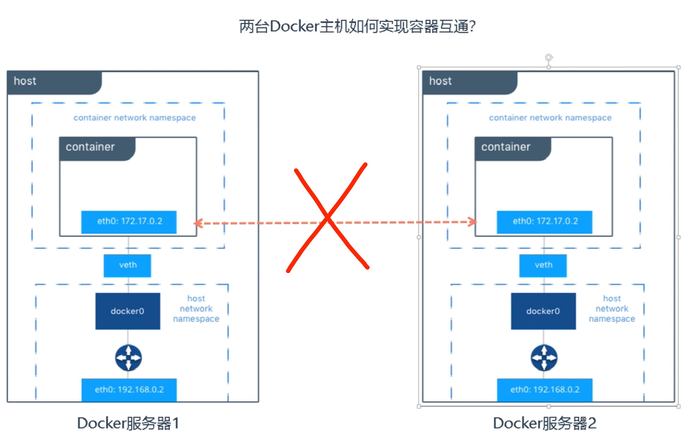
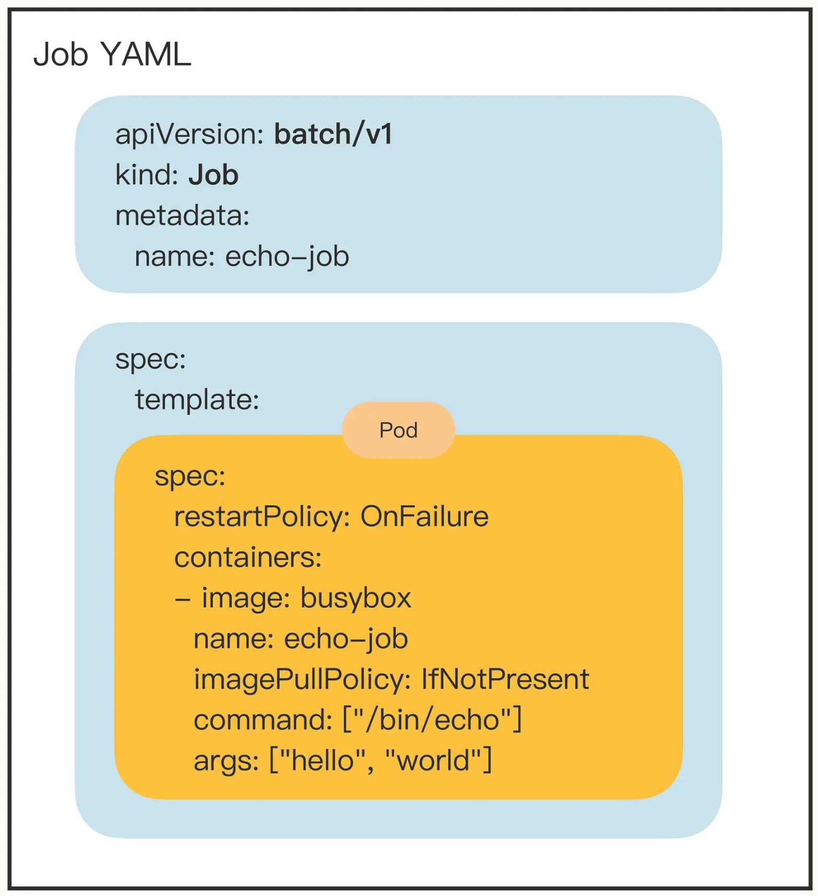
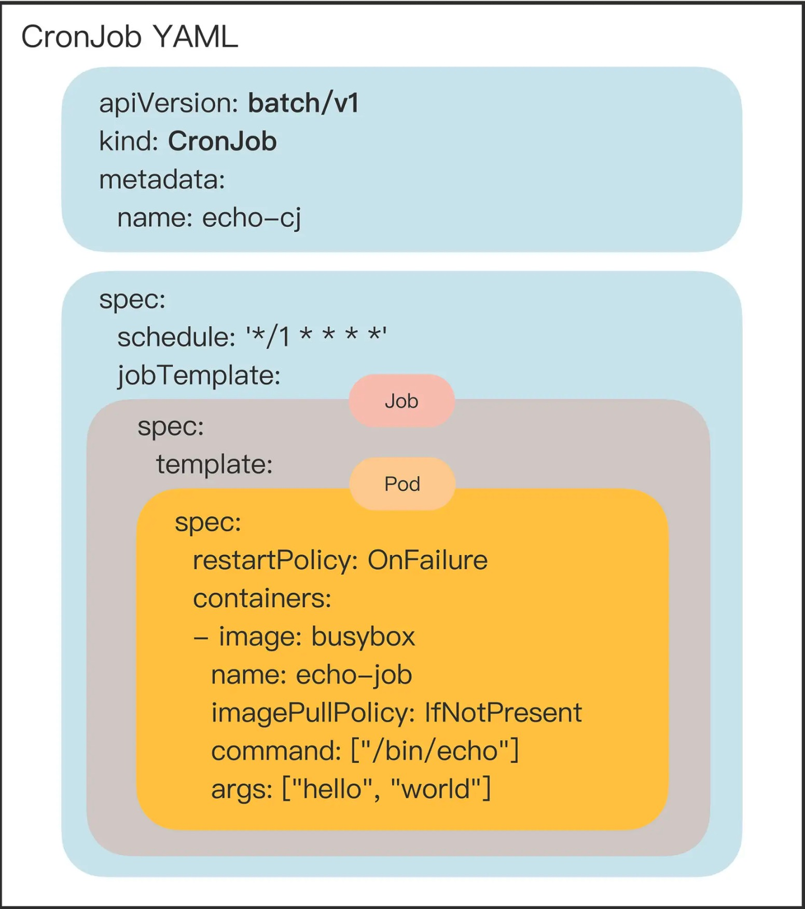
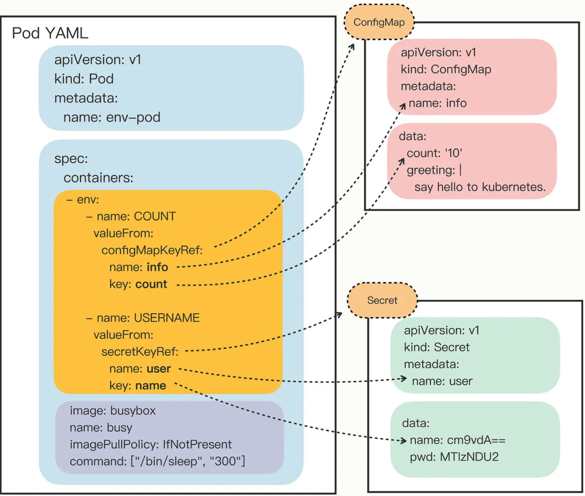
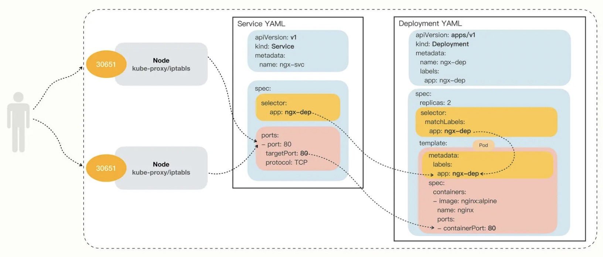
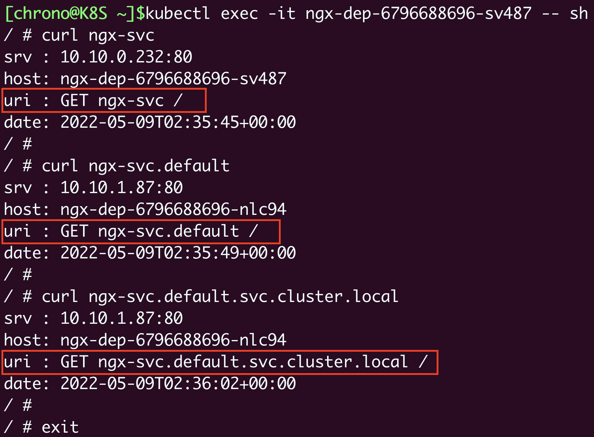

# k8s-cka

- 集群架构，安装和配置：25%
- 工作负载和调度：15%
- 服务和网络：20%
- 存储：10%
- 故障排除：30%

> 有了Docker以后，为什么还要用K8s？

`企业需求`：为提高业务并发和高可用，会使用多态服务器集群。

- 多容器跨主机提供服务
- 多容器分部节点部署
- 多容器怎么升级部署
- 高效管理这些容器


> K8s是用于容器化应用程序的部署、扩展和管理，目标是让部署容器化应用简单高效。


## K8s集群架构与组件

https://user-images.githubusercontent.com/10555820/186076567-be539ef5-8912-40c4-83b4-ac42e3e58cca.mp4

### Master组件

- `kube-apiserver`

`Kubernetes API`，集群的统一入口，各组件协调者，以 `RESTful API` 提供接口服务，所有对象资源的增删改查和监听操作都交给 `API-Server` 处理后再提交给 Etcd 存储。

- `kube-controller-manager`

处理急群众常规后台任务，一个资源对应一个控制器，而 ControllerManager 就是负责管理这些控制器的。

- `kube-schdeuler`

根据调度算法为新创建的 `Pod` 选择一个 `Node` 节点，可以任意部署，可以部署在同一个节点上，也可以部署在不同的节点上。

- etcd

分布式减值存储系统。用于保存集群状态数据，比如 `Pod`、`Service` 等对象信息。

### Node组件

- kubelet

`kublet` 是 `Master` 在Node节点上的 `Agent`，管理本机运行容器的生命周期，比如创建容器、Pod挂载数据卷、下载secret、获取容器和节点状态等工作。`kubelet` 将每个 `Pod` 转换成一组容器。

- kube-proxy

在 `Node` 节点上实现 `Pod` 网络代理，维护网络规则和四层负载均衡工作。

- docker 或 rocket

容器引擎，运行容器。

## K8s集群搭建

生成环境部署k8s的两种方式

- `kubeadm`

Kubeadm是一个工具，提供 kubeadm init 和 kubeadm join，用于快速部署k8s集群

- `二进制`

💯 推荐，从官方下载发行版的二进制包，手动部署每个组件，组件k8s集群

> 部署 `k8s` 时必须关闭 `swap`
>
> kubeadm 组件容器化部署（镜像），kubelet没有容器化，使用systemctl管理，有守护进程

- 服务器硬件推荐配置
- 使用kubeadm快速部署一个k8s集群
- k8s CNI 网络模型
- kubectl 命令行管理工具

### kubeadm init工作流程

1. 安装环境检查，例如swapoff有没有关、机器配置符合不符合
2. 下载镜像 kubeadm config images pull
3. 生成证书，保存路径/etc/kubernetes/pki（k8s、etcd）
4. [kubeconfig] 生成kubeconfig文件
5. [kubelet-start] 生成kubelet配置文件并启动
6. [control-plane] 启动master节点组件
7. 将一些配置文件存储到configmap中，用于其他节点初始拉取
8. [mark-control-plane] 给master节点打污点，不让pod在上面运行
9. [bootstrap-token] 自动为kubelet颁发证书
10. [addons] 安装插件 CoreDNS kube-proxy

## 使用kubeadm快速搭建k8s集群

```bash
# 创建一个 Master 节点
kubeadm init


# 将一个 Node 节点加入到指定集群里
kubeadm join <Master节点的ip和port>
```

### 1. 安装要求

在开始之前，部署 `Kubernetes` 集群机器需要满足以下几个条件：

- 一台或多台机器，操作系统 CentOS7.x-86_x64
- 硬件配置：2GB或更多RAM，2个CPU或更多CPU，硬盘30GB或更多
- 集群中所有机器之间网络互通
- 可以访问外网，需要拉取镜像
- 禁止swap分区

### 2. 准备环境

| 角色       | IP            |
| ---------- | ------------- |
| k8s-master | 192.168.31.61 |
| k8s-node1  | 192.168.31.62 |
| k8s-node2  | 192.168.31.63 |

```bash
关闭防火墙：
$ systemctl stop firewalld
$ systemctl disable firewalld

关闭selinux：
$ sed -i 's/enforcing/disabled/' /etc/selinux/config  # 永久
$ setenforce 0  # 临时

关闭swap：
$ swapoff -a  # 临时
$ vim /etc/fstab  # 永久

设置主机名：
$ hostnamectl set-hostname <hostname>

在master添加hosts：
$ cat >> /etc/hosts << EOF
192.168.31.61 k8s-master
192.168.31.62 k8s-node1
192.168.31.63 k8s-node2
EOF

将桥接的IPv4流量传递到iptables的链：
$ cat > /etc/sysctl.d/k8s.conf << EOF
net.bridge.bridge-nf-call-ip6tables = 1
net.bridge.bridge-nf-call-iptables = 1
EOF
$ sysctl --system  # 生效

时间同步：
$ yum install ntpdate -y
$ ntpdate time.windows.com
```

### 3. 安装Docker/kubeadm/kubelet【所有节点】

`Kubernetes` 默认CRI（容器运行时）为Docker，因此先安装Docker。

#### 3.1 安装Docker

- 去DigitalOcean翻教程，那里最好
- 配置镜像下载加速器

## 基于kubeadmin安装k8s集群

> 已在DO的Ubuntu 20.2中测试，22中不行！ —— 2022.8.22
>
> 记得给api-server放个外网地址！

```
# https://kubernetes.io/docs/setup/production-environment/tools/kubeadm/install-kubeadm/
# https://github.com/containerd/containerd/issues/4581
# https://www.devopsroles.com/install-kubernetes-on-ubuntu/

# (Common)
# Install Docker
sudo apt update
sudo apt install apt-transport-https ca-certificates curl software-properties-common -y
curl -fsSL https://download.docker.com/linux/ubuntu/gpg | sudo apt-key add -
sudo add-apt-repository "deb [arch=amd64] https://download.docker.com/linux/ubuntu focal stable"
apt-cache policy docker-ce
sudo apt install docker-ce -y

sudo systemctl status docker


# (master node)
# sysctl params required by setup, params persist across reboots
cat <<EOF | sudo tee /etc/sysctl.d/k8s.conf
net.bridge.bridge-nf-call-iptables  = 1
net.bridge.bridge-nf-call-ip6tables = 1
EOF

# Apply sysctl params without reboot
sudo sysctl --system


# Installation
curl -s https://packages.cloud.google.com/apt/doc/apt-key.gpg | sudo apt-key add -

cat <<EOF | sudo tee /etc/apt/sources.list.d/kubernetes.list
deb https://apt.kubernetes.io/ kubernetes-xenial main
EOF

apt-get update
apt-get install -y kubelet kubeadm kubectl
apt-mark hold kubelet kubeadm kubectl


rm /etc/containerd/config.toml
systemctl restart containerd


kubeadm init --pod-network-cidr=10.244.0.0/16 

kubeadm init --pod-network-cidr=10.244.0.0/16 --apiserver-advertise-address=10.124.0.3,114.215.201.87

kubeadm join 10.124.0.3:6443 --token ljnag3.ro3wwkfw3x2mb5pk \
	--discovery-token-ca-cert-hash sha256:c9943b5e9d2c00bc1a88a3ea26a21e78f08cc541e2d8f0f726cb8cfa2e90fd05

# --------------------

# Installation (Worker node)
curl -s https://packages.cloud.google.com/apt/doc/apt-key.gpg | sudo apt-key add -

cat <<EOF | sudo tee /etc/apt/sources.list.d/kubernetes.list
deb https://apt.kubernetes.io/ kubernetes-xenial main
EOF

apt-get update
apt-get install -y kubelet kubeadm kubectl
apt-mark hold kubelet kubeadm kubectl


# --------最后初始化网络
kubectl apply -f https://raw.githubusercontent.com/flannel-io/flannel/master/Documentation/kube-flannel.yml
```

## k8s CNI网络模型



解决的问题：

- 1.统一管理这些k8s node网段，保障每个容器分配不一样的ip地址
- 2.要知道转发给哪个docker主机？
- 2.怎么实现这个转发(从docker主机1的容器A转发到另一台docker主机2的容器β)

CNI (Container Network Interface, 容器网络接口): 是一个容器网络规范，k8s网络就是采用CNI规范。

**k8s是一个扁平化网络。**

> 即所有部署的网络组件都必须满足如下要求：

- 一个 `Pod` 一个 `IP`
- 所有的 Pod 可以与任何其他 Pod 直接通信
- 所有节点可以与所有 Pod 同时直接通信
- Pod 内部获取到的 IP 地址与其他 Pod 或者节点与其通信时的IP地址是同一个

主流网络组件有： `Flannel` `Calico` 等


## 实验：Job/CronJob

```bash
export out="--dry-run=client -o yaml"
kubectl create job echo-job --image=busybox $out
```

```yaml
apiVersion: batch/v1
kind: Job
metadata:
  name: echo-job

spec:
  template:
    spec:
      restartPolicy: OnFailure
      containers:
      - image: busybox
        name: echo-job
        imagePullPolicy: IfNotPresent
        command: ["/bin/echo"]
        args: ["hello", "world"]
```

- 此时我们在YAML里看到了两个spec，这个是咋回事呢？
  - 其实就是在Job对象里使用了组合模式的结果
  - template 字段定义了一个应用模板，里面又嵌套了一个 Pod，这样Job就可以才这个模板里创造新的Pod出来
  - 而这个Pod是受到Job管理控制的，不能与apiserver打交道



```bash
~/k8s ⌚ 17:40:53
$ k get job
NAME       COMPLETIONS   DURATION   AGE
echo-job   1/1           5s         12s

~/k8s ⌚ 17:40:57
$ k get pod
NAME             READY   STATUS      RESTARTS   AGE
echo-job-jtjzz   0/1     Completed   0          16s
```

> 的确，我看到了新的Pod，它其实是被Job管理的。
>
> 来吧，提升一下。

- activeDeadlineSeconds，设置 Pod 运行的超时时间。
- backoffLimit，设置 Pod 的失败重试次数。
- completions，Job 完成需要运行多少个 Pod，默认是 1 个。
- parallelism，它与 completions 相关，表示允许并发运行的 Pod 数量，避免过多占用资源。

```yaml
apiVersion: batch/v1
kind: Job
metadata:
  name: sleep-job

spec:
  activeDeadlineSeconds: 15
  backoffLimit: 2
  completions: 4
  parallelism: 2

  template:
    spec:
      restartPolicy: OnFailure
      containers:
      - image: busybox
        name: echo-job
        imagePullPolicy: IfNotPresent
        command:
          - sh
          - -c
          - sleep $(($RANDOM % 10 + 1)) && echo done
```

> 创建一个 Job 对象，名字叫“sleep-job”，它随机睡眠一段时间再退出，模拟运行时间较长的作业（比如 MapReduce）。Job 的参数设置成 15 秒超时，最多重试 2 次，总共需要运行完 4 个 Pod，但同一时刻最多并发 2 个 Pod。

```bash
~/k8s ⌚ 17:55:05
$ k apply -f sleep-job.yaml
job.batch/sleep-job created

~/k8s ⌚ 17:55:15
$ kubectl get pod -w
NAME              READY   STATUS      RESTARTS   AGE
sleep-job-b9fqt   1/1     Running     0          6s
sleep-job-clqrl   1/1     Running     0          11s
sleep-job-lpm8q   0/1     Completed   0          11s
sleep-job-clqrl   0/1     Completed   0          11s
sleep-job-b9fqt   0/1     Completed   0          6s
sleep-job-clqrl   0/1     Completed   0          13s
sleep-job-xmqn8   0/1     Pending     0          0s
sleep-job-xmqn8   0/1     Pending     0          0s
sleep-job-b9fqt   0/1     Completed   0          8s
sleep-job-xmqn8   0/1     ContainerCreating   0          0s
sleep-job-xmqn8   1/1     Running             0          1s
sleep-job-xmqn8   1/1     Terminating         0          2s
sleep-job-xmqn8   0/1     Terminating         0          2s
sleep-job-xmqn8   0/1     Terminating         0          4s
sleep-job-xmqn8   0/1     Terminating         0          4s
sleep-job-xmqn8   0/1     Terminating         0          4s
```



```yaml
apiVersion: batch/v1
kind: CronJob
metadata:
  name: echo-cj

spec:
  schedule: '*/1 * * * *'
  jobTemplate:
    spec:
      template:
        spec:
          restartPolicy: OnFailure
          containers:
          - image: busybox
            name: echo-cj
            imagePullPolicy: IfNotPresent
            command: ["/bin/echo"]
            args: ["hello", "world"]
```

```bash
$ k get pod
NAME                     READY   STATUS      RESTARTS   AGE
echo-cj-27666143-z5m9j   0/1     Completed   0          2m14s
echo-cj-27666144-x6ndt   0/1     Completed   0          74s
echo-cj-27666145-tfpqm   0/1     Completed   0          14s
```







## PersistentVolume

> PV相关小实验

### host-path 的PV使用

- 第一步: 肯先定义PV，注意类型是 `storageClassName: host-test`
  - 有个问题得注意 host-path 只能是 `ReadWriteOnce`

```yml
apiVersion: v1
kind: PersistentVolume
metadata:
  name: host-10m-pv

spec:
  storageClassName: host-test
  accessModes:
  - ReadWriteOnce
  capacity:
    storage: 10Mi
  hostPath:
    path: /tmp/host-10m-pv/
```

- 第二步：来个pvc，声明下我们有这么一个需求，怎么批，由k8s自己调度去
  - 注意，这里我们需要定义的需求尽可能接近pv的定义，这样就可以匹配到了
  - 估计k8s肯定有一个匹配算法，磁盘的大小、快慢、读写模式等等

```yml
apiVersion: v1
kind: PersistentVolumeClaim
metadata:
  name: host-5m-pvc

spec:
  storageClassName: host-test
  accessModes:
    - ReadWriteOnce
  resources:
    requests:
      storage: 5Mi
```

> 第二步执行了以后，记得去看下pv和pvc是否绑定在一起了。


- 第三步：给Pod挂载PersistentVolume
  - 虽然嘴巴上说是PersistentVolume，但我们要用的其实是 pvc
  - `claimName: host-5m-pvc` 是pvc的metadata里的 `name` 哦！

```yml
apiVersion: v1
kind: Pod
metadata:
  name: host-pvc-pod

spec:
  volumes:
  - name: host-pvc-vol
    persistentVolumeClaim:
      claimName: host-5m-pvc

  containers:
    - name: ngx-pvc-pod
      image: nginx:alpine
      ports:
      - containerPort: 80
      volumeMounts:
      - name: host-pvc-vol
        mountPath: /tmp
```

> 等pod启了以后，我们进去实验一下：

```bash
k exec -it host-pvc-pod -- sh

cd /tmp
touch szy.txt
```


### PV + NFS

> 刚刚那个是单机的，我们得来个网络盘才行。
>
> 晕死，一定要在ngs服务端提前建好文件夹


```yml
apiVersion: v1
kind: PersistentVolume
metadata:
  name: nfs-1g-pv

spec:
  storageClassName: nfs
  accessModes:
    - ReadWriteMany
  capacity:
    storage: 1Gi

  nfs:
    path: /tmp/nfs/1g-pv
    server: 10.124.0.2

###

apiVersion: v1
kind: PersistentVolumeClaim
metadata:
  name: nfs-static-pvc

spec:
  storageClassName: nfs
  accessModes:
    - ReadWriteMany

  resources:
    requests:
      storage: 1Gi

###

apiVersion: v1
kind: Pod
metadata:
  name: nfs-static-pod

spec:
  volumes:
  - name: nfs-pvc-vol
    persistentVolumeClaim:
      claimName: nfs-static-pvc

  containers:
    - name: nfs-pvc-test
      image: nginx:alpine
      ports:
      - containerPort: 80

      volumeMounts:
        - name: nfs-pvc-vol
          mountPath: /tmp
```


### PV + Provisioner

> 现在PV已经能动态了，可以适应飘逸pod了，但还需要人工分配，麻烦了。
>
> k8s 里有“动态存储卷”的概念，它可以用 StorageClass 绑定一个 Provisioner 对象，而这个 Provisioner 就是一个能够自动管理存储、创建 PV 的应用，代替了原来系统管理员的手工劳动。
>
> 真的不容易啊，做个k8s的实验！


