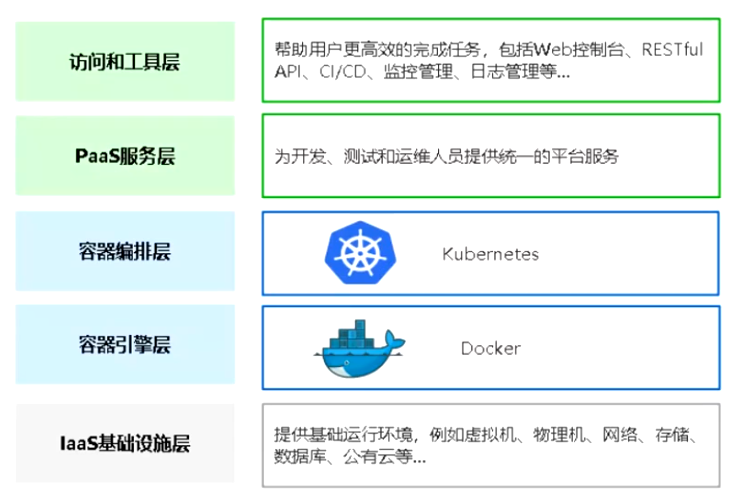
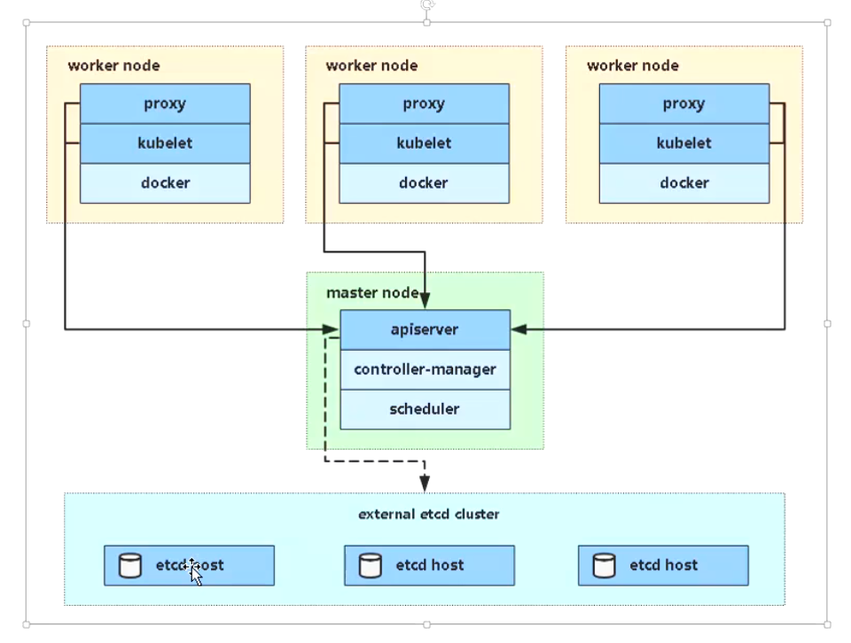

# k8s-cka

- 集群架构，安装和配置：25%
- 工作负载和调度：15%
- 服务和网络：20%
- 存储：10%
- 故障排除：30%

> 有了Docker以后，为什么还要用K8s？

`企业需求`：为提高业务并发和高可用，会使用多态服务器集群。

- 多容器跨主机提供服务
- 多容器分部节点部署
- 多容器怎么升级部署
- 高效管理这些容器



> K8s是用于容器化应用程序的部署、扩展和管理，目标是让部署容器化应用简单高效。



## K8s集群架构与组件

### Master组件

- `kube-apiserver`

`Kubernetes API`，集群的统一入口，各组件协调者，以 `RESTful API` 提供接口服务，所有对象资源的增删改查和监听操作都交给 `API-Server` 处理后再提交给 Etcd 存储。

- `kube-controller-manager`

处理急群众常规后台任务，一个资源对应一个控制器，而 ControllerManager 就是负责管理这些控制器的。

- `kube-schdeuler`

根据调度算法为新创建的 `Pod` 选择一个 `Node` 节点，可以任意部署，可以部署在同一个节点上，也可以部署在不同的节点上。

- etcd

分布式减值存储系统。用于保存集群状态数据，比如 `Pod`、`Service` 等对象信息。

### Node组件

- kubelet

`kublet` 是 `Master` 在Node节点上的 `Agent`，管理本机运行容器的生命周期，比如创建容器、Pod挂载数据卷、下载secret、获取容器和节点状态等工作。`kubelet` 将每个 `Pod` 转换成一组容器。

- kube-proxy

在 `Node` 节点上实现 `Pod` 网络代理，维护网络规则和四层负载均衡工作。

- docker 或 rocket

容器引擎，运行容器。

## K8s集群搭建

生成环境部署k8s的两种方式

- `kubeadm`

Kubeadm是一个工具，提供 kubeadm init 和 kubeadm join，用于快速部署k8s集群

```bash
# 创建一个 Master 节点
kubeadm init


# 将一个 Node 节点加入到指定集群里
kubeadm join <Master节点的ip和port>
```

- `二进制`

💯 推荐，从官方下载发行版的二进制包，手动部署每个组件，组件k8s集群

> 部署 `k8s` 时必须关闭 `swap`

- 服务器硬件推荐配置
- 使用kubeadm快速部署一个k8s集群
- k8s CNI 网络模型
- kubectl 命令行管理工具

### kubeadm init工作流程

1. 安装环境检查，例如swapoff有没有关、机器配置符合不符合
2. 下载镜像 kubeadm config images pull
3. 生成证书，保存路径/etc/kubernetes/pki（k8s、etcd）
4. [kubeconfig] 生成kubeconfig文件
5. [kubelet-start] 生成kubelet配置文件并启动
6. [control-plane] 启动master节点组件
7. 将一些配置文件存储到configmap中，用于其他节点初始拉取
8. [mark-control-plane] 给master节点打污点，不让pod在上面运行
9. [bootstrap-token] 自动为kubelet颁发证书
10. [addons] 安装插件 CoreDNS kube-proxy

